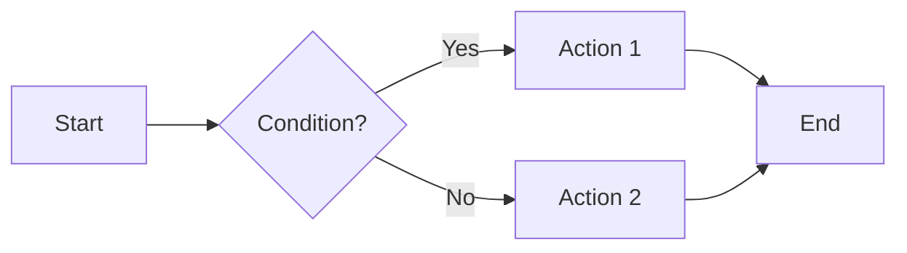

# Advanced markdown elements

MkDocs and the Material theme support advanced Markdown extensions that let you create richer, more interactive content. This guide covers the most useful features.

## Admonitions (Callout boxes)

Admonitions are highlighted boxes used to draw attention to important information.

### Basic syntax

```markdown
!!! note "Optional title"
    This is the note content.
    It can span multiple lines.
```

### Available types

```markdown
!!! note
    General information

!!! info
    Additional information

!!! tip
    Tips and recommendations

!!! success
    Success messages

!!! warning
    Important warnings

!!! danger
    Dangers and critical errors

!!! example
    Code or usage examples

!!! question
    Frequently asked questions
```

!!! note
    General information

!!! info
    Additional information

!!! tip
    Tips and recommendations

!!! success
    Success messages

!!! warning
    Important warnings

!!! danger
    Dangers and critical errors

!!! example
    Code or usage examples

!!! question
    Frequently asked questions

### Collapsible admonitions

```markdown
??? note "Click to expand"
    This content is hidden by default.

???+ warning "Expanded by default"
    This content is visible by default but can be collapsed.
```

**Example in action:**

??? note "Click to expand"
    This content is hidden by default.

???+ warning "Expanded by default"
    This content is visible by default but can be collapsed.

## Tabs

Tabs allow you to organize alternative content:

````markdown
=== "Python"
    ```python
    def greet():
        print("Hello from Python")
    ```

=== "JavaScript"
    ```javascript
    function greet() {
        console.log("Hello from JavaScript");
    }
    ```

=== "C#"
    ```csharp
    void Greet() {
        Console.WriteLine("Hello from C#");
    }
    ```
````

**Example in action:**

=== "Python"
    ```python
    def greet():
        print("Hello from Python")
    ```

=== "JavaScript"
    ```javascript
    function greet() {
        console.log("Hello from JavaScript");
    }
    ```

=== "C#"
    ```csharp
    void Greet() {
        Console.WriteLine("Hello from C#");
    }
    ```

## Advanced code blocks

### With a title

````markdown
```python title="my_script.py"
def add(a, b):
    return a + b
```
````

**Example in action:**

```python title="my_script.py"
def add(a, b):
    return a + b
```

### Highlight specific lines

````markdown
```python hl_lines="2 3"
def example():
    highlighted_line_1 = "This line is highlighted"
    highlighted_line_2 = "This one too"
    normal_line = "This one isn't"
```
````

**Example in action:**

```python hl_lines="2 3"
def example():
    highlighted_line_1 = "This line is highlighted"
    highlighted_line_2 = "This one too"
    normal_line = "This one isn't"
```

## Emojis

Use emoji codes to add icons:

```markdown
:smile: :heart: :rocket: :tada: :warning:
```

**Result:**
:smile: :heart: :rocket: :tada: :warning:

Full list at: [Emoji Cheat Sheet](https://www.webfx.com/tools/emoji-cheat-sheet/)

## Material Design icons

The Material theme includes thousands of icons:

```markdown
:material-account-circle: User
:material-alert-circle: Alert
:material-check-circle: Success
:material-information: Information
```

**Result:**
:material-account-circle: User
:material-alert-circle: Alert
:material-check-circle: Success
:material-information: Information

Explore all icons at: [Material Design Icons](https://pictogrammers.com/library/mdi/)

## Buttons

Create buttons with links:

```markdown
[Primary button](#){ .md-button }
[Highlighted button](#){ .md-button .md-button--primary }
```

**Example in action:**

[Primary button](#){ .md-button }
[Highlighted button](#){ .md-button .md-button--primary }

## Definition lists

```markdown
Term 1
:   Definition of term 1

Term 2
:   Definition of term 2
:   Can have multiple definitions
```

**Example in action:**

MkDocs
:   Static site generator for project documentation

Material Theme
:   Popular and modern theme for MkDocs
:   Includes many advanced features ready to use

## Abbreviations

Define abbreviations that will show tooltips:

```markdown
HTML is a markup language.
CSS controls styling.

*[HTML]: HyperText Markup Language
*[CSS]: Cascading Style Sheets
```

When you hover over HTML or CSS, you’ll see their full meaning.

*[HTML]: HyperText Markup Language
*[CSS]: Cascading Style Sheets

## Keyboard markup

Display keys and key combinations:

```markdown
Press ++ctrl+alt+del++ to open the task manager.
Use ++cmd+space++ on Mac to search.
```

**Example in action:**

Press ++ctrl+alt+del++ to open the task manager.

Use ++cmd+space++ on Mac to search.

Save file: ++ctrl+s++

## Diagrams

Create flowcharts, sequence diagrams, etc.:

````markdown

````

**Example in action:**


!!! info "Learn more about diagrams"
To see all available diagram types and detailed examples, visit the [official Mermaid documentation](https://mermaid.js.org/intro/).

## Content annotations

Add pop-up notes to content:

```markdown
This text has an annotation.(1)
{ .annotate }

1.  :material-information: This is the annotation shown on the side.
```

**Example in action:**

MkDocs (1) is a static site generator specifically designed for documentation (2).
{ .annotate }

1. :material-book-open-page-variant: MkDocs is fast, simple, and fully customizable.
2. :material-file-document: Use Markdown files to create professional HTML pages.

## Footnotes

```markdown
This is a text with a footnote[^1].

[^1]: This is the footnote.
```

**Result:**

This is a text with a footnote[^1].

[^1]: This is the footnote.

## Custom attributes

Add classes, IDs, and attributes to elements:

```markdown
{ width="300" }

[Link](url){ target="_blank" rel="noopener" }

Paragraph with a custom class
{ .my-css-class }
```

**Example in action:**

[Open in a new tab](https://www.mkdocs.org){ target="_blank" rel="noopener" .md-button }

!!! info
    Text styled using the fh-info-card class.

## Variables and macros

Define reusable variables in `mkdocs.yml`:

```yaml
extra:
  version: "2.0"
  company: "My Company"
```

Use them in Markdown:

```markdown
Current version: {{ version }}
Developed by {{ company }}
```

## Next steps

Now that you know advanced Markdown features:

1. **Add custom components** - Learn about [Custom components](CustomComponents.md) for interactive elements
2. **Apply custom styling** - Check [Custom classes](CustomClasses.md) for special visual effects
3. **Build your site** - See [Building your site](../Deployment/BuildingYourSite.md) to compile for production