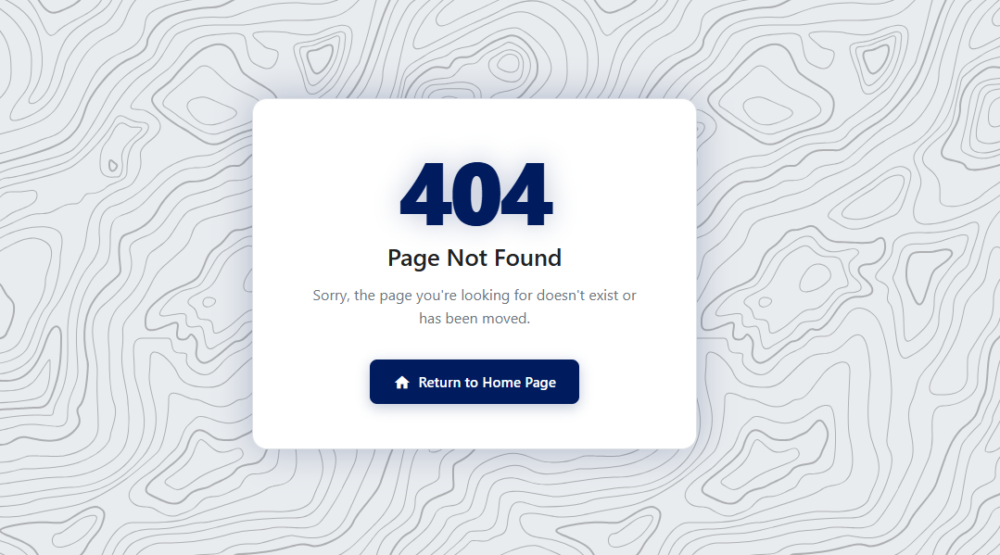
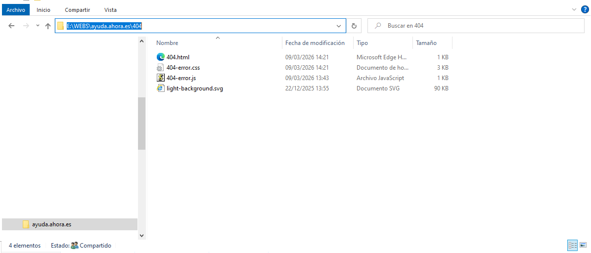

# 404 error page

This page explains how to create your own 404 skin and deploy it on `ayuda.ahora.es/404` so you can modify the colors the default 404 error page uses:



## Create your own skin

To add a new product skin, update two files on the `404-error-page` folder:

1. In `404-error.js`, add your product code in the `codes` array.
2. In `404-error.css`, create your CSS class using the format `.skin-theproduct`.

With that done if the user introduces a bdaly written URL in your URL it will redirect to tour project and the 404 error page will have your own colors.

!!! info "Product Code"
    The product code in `codes` must be the same as your folder name in the URL, always in lowercase.

    - `ayuda.ahora.es/flexygo` → `flexygo`
    - `ayuda.ahora.es/crm` → `crm`

```js
// 404-error.js
const codes = ['flexygo', 'theproduct'];
```

```css
/* 404-error.css */
.skin-theproduct {
    --accent:       #123456;
    --accent-hover: #0f2f4a;
    --code-glow:    rgba(18, 52, 86, 0.25);
}
```

What these variables modify:

- `--accent`: main color used by the 404 number and button background.
- `--accent-hover`: button background color on hover.
- `--code-glow`: glow/shadow color used around the 404 box, number and button.

## Deploy to ayuda.ahora.es

After your changes are ready, you must access the web server and replace the current files inside `E:\WEBS\ayuda.ahora.es\404` with your modified files.

