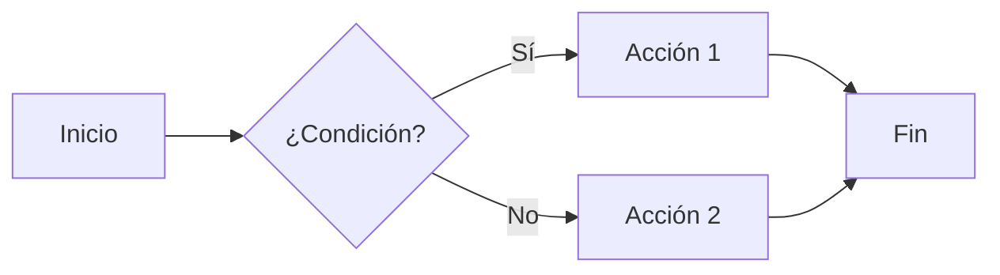

# Elementos Avanzados de Markdown

MkDocs y el tema Material soportan extensiones avanzadas de Markdown que te permiten crear contenido más rico e interactivo. Esta guía cubre las funcionalidades más útiles.

## Admonitions (Cajas de aviso)

Las admonitions son cajas destacadas para llamar la atención sobre información importante.

### Sintaxis básica

```markdown
!!! note "Título opcional"
    Este es el contenido de la nota.
    Puede tener múltiples líneas.
```

### Tipos disponibles

```markdown
!!! note
    Información general

!!! info
    Información adicional

!!! tip
    Consejos y recomendaciones

!!! success
    Mensajes de éxito

!!! warning
    Advertencias importantes

!!! danger
    Peligros y errores críticos

!!! example
    Ejemplos de código o uso

!!! question
    Preguntas frecuentes
```

!!! note
    Información general

!!! info
    Información adicional

!!! tip
    Consejos y recomendaciones

!!! success
    Mensajes de éxito

!!! warning
    Advertencias importantes

!!! danger
    Peligros y errores críticos

!!! example
    Ejemplos de código o uso

!!! question
    Preguntas frecuentes

### Admonitions colapsables

```markdown
??? note "Click para expandir"
    Este contenido está oculto por defecto.

???+ warning "Expandido por defecto"
    Este contenido está visible por defecto pero se puede colapsar.
```

**Ejemplo en acción:**

??? note "Click para expandir"
    Este contenido está oculto por defecto.

???+ warning "Expandido por defecto"
    Este contenido está visible por defecto pero se puede colapsar.

## Pestañas (Tabs)

Las pestañas permiten organizar contenido alternativo:

```markdown
=== "Python"
    ```python
    def saludar():
        print("Hola desde Python")
    ```

=== "JavaScript"
    ```javascript
    function saludar() {
        console.log("Hola desde JavaScript");
    }
    ```

=== "C#"
    ```csharp
    void Saludar() {
        Console.WriteLine("Hola desde C#");
    }
    ```
```

**Ejemplo en acción:**

=== "Python"

    ```python
    def saludar():
        print("Hola desde Python")
    ```

=== "JavaScript"

    ```javascript
    function saludar() {
        console.log("Hola desde JavaScript");
    }
    ```

=== "C#"

    ```csharp
    void Saludar() {
        Console.WriteLine("Hola desde C#");
    }
    ```

## Bloques de código avanzados

### Con título

````markdown
```python title="mi_script.py"
def calcular_suma(a, b):
    return a + b
```
````

**Ejemplo en acción:**

```python title="mi_script.py"
def calcular_suma(a, b):
    return a + b
```

### Resaltar líneas específicas

````markdown
```python hl_lines="2 3"
def ejemplo():
    linea_resaltada_1 = "Esta línea está resaltada"
    linea_resaltada_2 = "Esta también"
    linea_normal = "Esta no"
```
````

**Ejemplo en acción:**

```python hl_lines="2 3"
def ejemplo():
    linea_resaltada_1 = "Esta línea está resaltada"
    linea_resaltada_2 = "Esta también"
    linea_normal = "Esta no"
```

## Emojis

Usa códigos de emoji para agregar iconos:

```markdown
:smile: :heart: :rocket: :tada: :warning:
```

**Resultado:**
:smile:  :heart: :rocket: :tada: :warning:

Lista completa en: [Emoji Cheat Sheet](https://www.webfx.com/tools/emoji-cheat-sheet/)

## Iconos de Material Design

El tema Material incluye miles de iconos:

```markdown
:material-account-circle: Usuario
:material-alert-circle: Alerta
:material-check-circle: Éxito
:material-information: Información
```

**Resultado:** 
:material-account-circle: Usuario
:material-alert-circle: Alerta
:material-check-circle: Éxito
:material-information: Información

Explora todos los iconos en: [Material Design Icons](https://pictogrammers.com/library/mdi/)

## Botones

Crea botones con enlaces:

```markdown
[Botón primario](#){ .md-button }
[Botón destacado](#){ .md-button .md-button--primary }
```

**Ejemplo en acción:**

[Botón primario](#){ .md-button }
[Botón destacado](#){ .md-button .md-button--primary }

## Listas de definición

```markdown
Término 1
:   Definición del término 1

Término 2
:   Definición del término 2
:   Puede tener múltiples definiciones
```

**Ejemplo en acción:**

MkDocs
:   Generador de sitios estáticos para documentación de proyectos

Material Theme
:   Tema popular y moderno para MkDocs
:   Incluye muchas funcionalidades avanzadas listas para usar

## Abreviaciones

Define abreviaciones que mostrarán tooltips:

```markdown
El HTML es un lenguaje de marcado.
El CSS controla el estilo.

*[HTML]: HyperText Markup Language
*[CSS]: Cascading Style Sheets
```

Al pasar el ratón sobre HTML o CSS, verás su significado completo.

*[HTML]: HyperText Markup Language
*[CSS]: Cascading Style Sheets

## Marcado de teclado

Muestra teclas y combinaciones:

```markdown
Presiona ++ctrl+alt+del++ para abrir el administrador de tareas.
Usa ++cmd+space++ en Mac para buscar.
```

**Ejemplo en acción:**

Presiona ++ctrl+alt+del++ para abrir el administrador de tareas.

Usa ++cmd+space++ en Mac para buscar.

Guardar archivo: ++ctrl+s++

## Diagramas

Crea diagramas de flujo, secuencia, etc.:

````markdown

````

**Ejemplo en acción:**


!!! info "Aprende más sobre diagramas"
    Para ver todos los tipos de diagramas disponibles y ejemplos detallados, visita la [documentación oficial de Mermaid](https://mermaid.js.org/intro/).

## Anotaciones de contenido

Agrega notas emergentes al contenido:

```markdown
Este texto tiene una anotación.(1)
{ .annotate }

1.  :material-information: Esta es la anotación que aparece al lado.
```

**Ejemplo en acción:**

MkDocs (1) es un generador de sitios estáticos especialmente diseñado para documentación (2).
{ .annotate }

1.  :material-book-open-page-variant: MkDocs es rápido, simple y completamente personalizable.
2.  :material-file-document: Usa archivos Markdown para crear páginas HTML profesionales.

## Notas de pie de página

```markdown
Este es un texto con una nota[^1].

[^1]: Esta es la nota al pie.
```

**Resultado:**

Este es un texto con una nota[^1].

[^1]: Esta es la nota al pie.

## Atributos personalizados

Agrega clases, IDs y atributos a elementos:

```markdown
{ width="300" }

[Enlace](url){ target="_blank" rel="noopener" }

Párrafo con clase personalizada
{ .mi-clase-css }
```

**Ejemplo en acción:**

[Abrir en nueva pestaña](https://www.mkdocs.org){ target="_blank" rel="noopener" .md-button }

Texto con estilo personalizado usando la clase fh-info-card.
{ .fh-info-card }

## Variables y macros

Define variables reutilizables en `mkdocs.yml`:

```yaml
extra:
  version: "2.0"
  company: "Mi Empresa"
```

Úsalas en Markdown:

```markdown
Versión actual: {{ version }}
Desarrollado por {{ company }}
```
