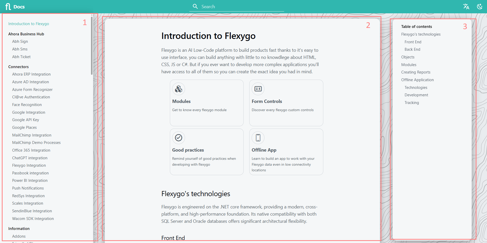
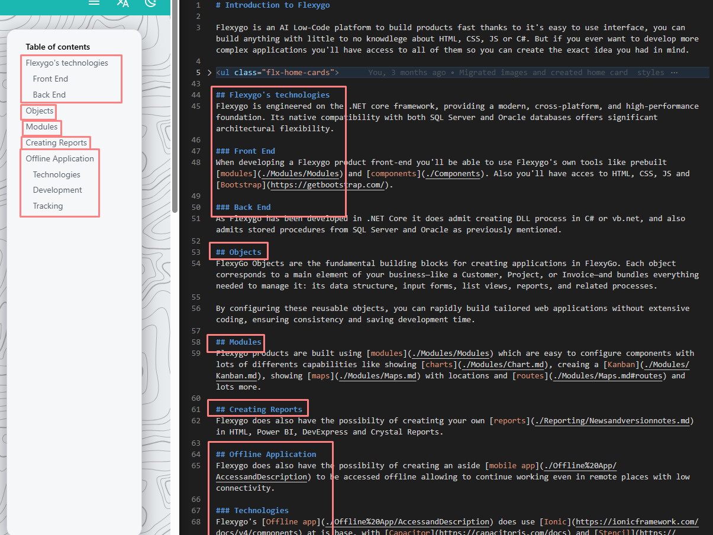

# Visual Structure

There are three sections of the help that are automatically generated: the [navigation bar](#1-navigation-bar), the [content block](#2-content-block), and the [sub-navigation menu](#3-sub-navigation-menu)

## 1 - Navigation bar

The navigation bar is automatically generated from the markdown files and folders that contain any .md file (these serve as grouping).

In the image, you can see that for each menu option, there are two files (one per language), but the visible name in the navigation is defined by the first title of each file. Thus, "index.es.md" appears as "Introduction to Flexygo".

## 2 - Content block

This block displays the content of the Markdown file in HTML. Additionally, it is possible to use HTML code within Markdown if necessary (although moderation is recommended to maintain coherence).

Here we take the opportunity to explain the file extensions:  
The **.es.md** files contain the Spanish version and the **.en.md** files contain the English version. To add translations to a section, simply create both files with the same base name.

## 3 - Sub-navigation menu

This menu allows you to navigate directly to the internal sections of the page you are on, identified by second or third level headings (# or ##, the latter are nested below the former).

Although it is less useful on short pages, it greatly facilitates reading on extensive documents.  

Keep in mind that, by configuration, only level # and ## headings are shown here. Fourth level headings (###) or higher will not appear in this menu.
{ .fh-warning-card }

