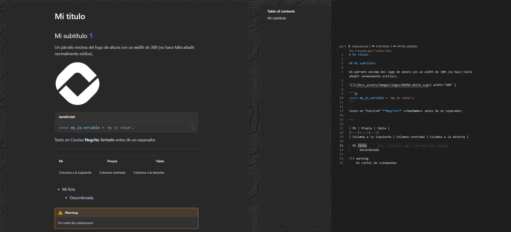

# Crear tu ayuda

Para empezar a entender como desarrollar tu ayuda creemos que lo mejor es empezar a crearla, para ello es que está esta sección.

## Obtener Template del Proyecto

Empezaremos descargandote este zip con la estructura base que toda ayuda de Ahora tendrá.

Una vez descargada descomprimiremos el archivo donde queramos crear la ayuda.

<button class="button" onclick="downloadTemplateZip()">Descargar ZIP</button>

## Entendiendo la plantilla

Para entender como funciona esta plantilla es necesario saber dos cosas, su estructura y el lengüaje utilizado

### MarkDown

MarkDown no es más que una forma sencilla de dar formato al texto sin necesidad de envolverlo todo en etiquetas html.

Poner títulos h1 es tan facil como que la línea empiece por `#`, los `h2` por `##` y así sucesivamente; los enlaces simplemente se escriben tal que `\[así\](/pagina/a/la/que/navegar)` y así con infinidad de cosas igualmente sencillas.

Aquí puedes ver por encima como funciona:

De todos modos para saber todo lo que se puede hacer recomendamos que al terminar de ver como funciona el proyecto de documentación eches un vistazo tanto a los [elementos básicos de MarkDown](./Markdown/BasicSyntax/) como los [elementos avanzados](./Markdown/ElementosAvanzados/).

Pero además de los básicos nosotros tenemos [nuestros propios componentes](./OurResources/OurComponents/) y [nuestras propias clases](./OurResources/OurClasses/).

### Estructra

La estructura de la plantilla es una muy básica, dentro de la carpeta de `docs` se situarán todos los archivos (páginas) que compondrán la ayuda. En base a su organización en carpetas, se autogenerará la página siguiendo la plantilla creada.

Esta plantilla es personalizable pero deberíamos mantener una coherencia entre nuestras ayudas.

Para entender completamente y poder empezar a desarrollar visita la sección de [estructura de ficheros](./Structure/FileStructure/) y después la de [estructura visual](./Structure/VisualStructure/).